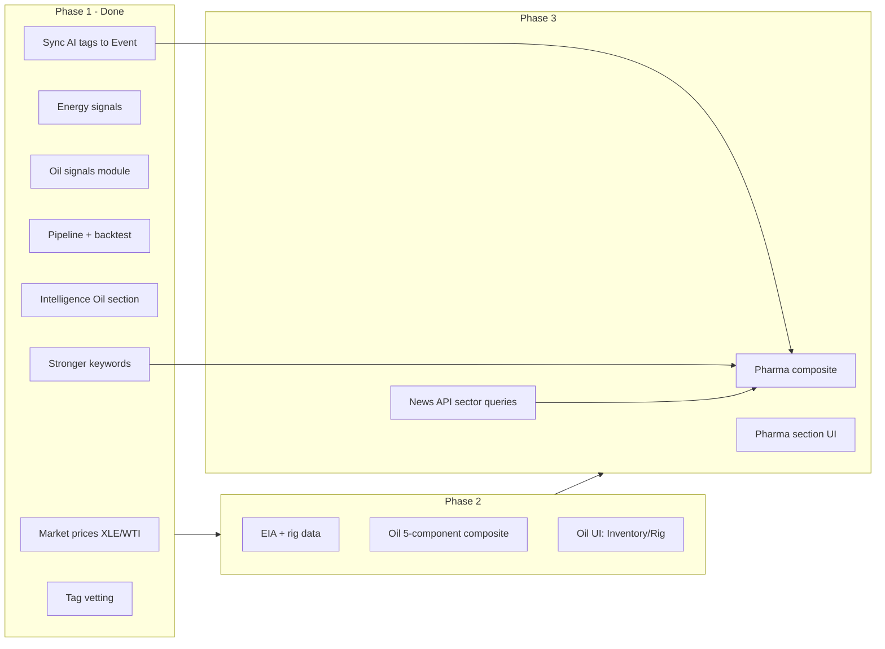

# Sprint plan & rollout

Consolidated view of sprint tasks and phased rollout. Details live in the linked docs.

---

## Phase 1 — Done

**Shipped:** Oil & Gas composite on Intelligence, ML pipeline uses AI tags (Groq) synced to Event, tag vetting (audit page), stronger keywords, two Core Signals dropdowns (Sentiment + Volume).

| # | Task | Owner | Notes |
|---|------|--------|--------|
| 1 | **Market prices: XLE + WTI proxy** | Dev | Add XLE and CL=F (or keep USO) to [src/lib/pipeline/market-prices.ts](src/lib/pipeline/market-prices.ts). Run pipeline; confirm rows. |
| 2 | **Energy signals in derived_signals** | Dev | Add `EnergySentiment` and `OilNewsVolume` to SIGNAL_DEFS in [src/lib/pipeline/derived-signals.ts](src/lib/pipeline/derived-signals.ts). Run part 1; confirm derived_signals. |
| 3 | **Oil signals module** | Dev | New [src/lib/pipeline/oil-signals.ts](src/lib/pipeline/oil-signals.ts): OilPriceMomentum (30d return → 60d z), 3-component composite (momentum + EnergySentiment + OilNewsVolume), write OilCompositeSignal to derived_signals. No EIA/rig in this phase. |
| 4 | **Pipeline + backtest wiring** | Dev | In [src/lib/pipeline/run.ts](src/lib/pipeline/run.ts): after runDerivedSignals call oil step; after runMarketPrices run backtests for OilCompositeSignal vs USO, XLE, SPY (e.g. 90d). |
| 5 | **Intelligence: Oil & Gas section** | Dev | Gauge (-3 to +3), component table (OilPriceMomentum, EnergySentiment, OilNewsVolume; Inventory/Rig “—” for now), one chart (signal vs USO/XLE), backtest panel (Sharpe, max DD, ann return, hit rate). |
| 6 | **Tagging: stronger keywords (quick win)** | Dev | In [src/lib/categories.ts](src/lib/categories.ts) expand Healthcare and Energy in CATEGORY_KEYWORDS (e.g. FDA, approval, phase 3, clinical trial, GLP-1 for Healthcare; more oil/OPEC terms for Energy). Fallback when Event has no AI tags. |
| 7 | **ML pipeline uses AI tags (Groq)** | Dev | **Priority.** After analyze (Groq), sync Article AI-assigned categories to the corresponding Event. Pipeline uses Event.categories when present; fallback to inferCategoriesFromText when empty. Sector signals (oil, pharma) then driven by Groq tags from earlier in the flow. See [PHARMA_SIGNAL_AND_DATA_STRATEGY.md](PHARMA_SIGNAL_AND_DATA_STRATEGY.md). |
| 8 | **Tag vetting for trading signals** | Dev | Ensure tags can be vetted before use in trading-signal experiments. Implement at least one: (a) **Audit view** — page listing recent articles with AI-assigned categories (and source, date) for spot-check; (b) **Validation** — categories must be in ARTICLE_CATEGORIES; log/sample for review. Optionally (c) doc that only vetted ingestion should be used for signals. |
| 9 | **Intelligence Core Signals: two dropdowns** | Dev | Replace single signal dropdown with **one Sentiment dropdown** (MarketsSentiment, FinanceSentiment, EnergySentiment, HealthcareSentiment when present) and **one Volume dropdown** (GeopoliticsVolume, RegulationVolume, WarConflictVolume, TechnologyVolume, OilNewsVolume, etc.). User picks one from each or one overall; chart shows selected signal. Keeps UI clean as we add oil/pharma signals. |

**References**

- Full Oil & Gas plan: [OIL_GAS_SIGNAL_PLAN.md](OIL_GAS_SIGNAL_PLAN.md) (Phase 1 = tomorrow; Phase 2 = EIA/rig later).
- Spec: [OIL_GAS_SIGNAL_SPEC.md](OIL_GAS_SIGNAL_SPEC.md).
- Tagging & pharma: [PHARMA_SIGNAL_AND_DATA_STRATEGY.md](PHARMA_SIGNAL_AND_DATA_STRATEGY.md).

---

## Rollout (what ships when)

*Twitter ingest is parked — not building in that direction for now (expensive API).*

### Phase 1 — Shipped

| Deliverable | Description |
|-------------|-------------|
| **Oil & Gas on Intelligence** | Oil composite (price momentum + Energy sentiment + Energy volume). Gauge, component table, chart, backtest vs USO/XLE/SPY. No EIA/rig. |
| **Better sector tagging** | Richer Healthcare and Energy keyword lists so pipeline gets more pharma/oil articles into daily_topic_metrics. |
| **Pipeline extended** | New oil-signals step; backtests for OilCompositeSignal persisted. |
| **ML pipeline uses AI tags (Groq)** | After analyze, Event gets Article's AI-assigned categories; pipeline uses them (fallback: keyword inference). Sector signals driven by Groq tags. |
| **Tag vetting** | Audit view and/or validation so tags can be vetted before use in trading-signal experiments. |
| **Core Signals: Sentiment + Volume dropdowns** | One dropdown for sentiment signals, one for volume signals; chart shows selected signal. Cleaner UX as we add more signals. |

**Out of scope for Phase 1:** EIA, Baker Hughes, pharma composite, Twitter.

---

### Phase 2 — After sprint (when data/bandwidth allows)

| # | Task | Owner | Notes |
|---|------|--------|--------|
| 1 | **Storage for EIA + rig** | Dev | Table(s) for weekly EIA inventory and Baker Hughes rig count; forward-fill to daily for pipeline. |
| 2 | **EIA + rig cron** | Dev | Cron job to fetch EIA and Baker Hughes; persist and forward-fill. |
| 3 | **Rig count signal** | Dev | RigTrend (or similar) from rig count; add to oil-signals. |
| 4 | **Extend oil composite to 5 components** | Dev | Add InventoryShock, RigTrend to composite in [oil-signals.ts](src/lib/pipeline/oil-signals.ts); write to derived_signals. |
| 5 | **Oil UI: Inventory/Rig** | Dev | Show InventoryShock and RigTrend in Oil & Gas component table; optional OilStressSignal / Energy Shock Risk on Intelligence. |

---

### Phase 3 — Pharma & data quality

| # | Task | Owner | Notes |
|---|------|--------|--------|
| 1 | **Healthcare signals in derived_signals** | Dev | Add HealthcareSentiment, HealthcareVolume (or PharmaNewsVolume) to SIGNAL_DEFS in [derived-signals.ts](src/lib/pipeline/derived-signals.ts) if not present. |
| 2 | **XLV in market prices** | Dev | Add XLV to [market-prices.ts](src/lib/pipeline/market-prices.ts); run pipeline. |
| 3 | **Pharma-signals module** | Dev | New pharma-signals step (or extend oil-signals pattern): XLV momentum, weighted composite with HealthcareSentiment + HealthcareVolume; backtest vs XLV/SPY. |
| 4 | **Pipeline wiring** | Dev | In [run.ts](src/lib/pipeline/run.ts): run pharma-signals step; persist backtests. |
| 5 | **News API sector queries** | Dev | Add sector "everything" queries (e.g. FDA, drug approval; oil, OPEC) so ingest gets more sector-specific articles. |
| 6 | **Intelligence: Pharma section** | Dev | Gauge, component table, chart, backtest panel for pharma composite (mirror Oil & Gas). |

---

### Parked — Twitter

**Not building in this direction for now.** Twitter/X API is expensive (~$200/mo Basic or pay-per-use). If we revisit later: ingest tweets as events (source = "twitter"), same pipeline (categories, sentiment, composites). See [PHARMA_SIGNAL_AND_DATA_STRATEGY.md](PHARMA_SIGNAL_AND_DATA_STRATEGY.md) for notes.

---

## Summary

- **Phase 1 (done):** Oil & Gas on Intelligence, AI tags to Event, tag vetting, two dropdowns, stronger keywords.
- **Phase 2:** EIA + rig data, 5-component oil composite, Oil UI with Inventory/Rig.
- **Phase 3:** Pharma composite (HealthcareSentiment, HealthcareVolume, XLV momentum), News API sector queries, Intelligence Pharma section.
- **Twitter (parked):** Not in current roadmap.

This file is the single place for rollout order and task lists.
