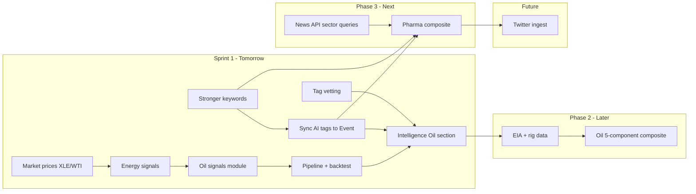

# Sprint plan & rollout

Consolidated view of sprint tasks (tomorrow) and phased rollout. Details live in the linked docs.

---

## Sprint — Tomorrow

**Goal:** Ship Oil & Gas composite on Intelligence (Phase 1), have the ML pipeline use AI tags (Groq) from earlier in the flow, add tag vetting so ingestion can be trusted for trading-signal experiments, and set up for pharma next.

| # | Task | Owner | Notes |
|---|------|--------|--------|
| 1 | **Market prices: XLE + WTI proxy** | Dev | Add XLE and CL=F (or keep USO) to [src/lib/pipeline/market-prices.ts](src/lib/pipeline/market-prices.ts). Run pipeline; confirm rows. |
| 2 | **Energy signals in derived_signals** | Dev | Add `EnergySentiment` and `OilNewsVolume` to SIGNAL_DEFS in [src/lib/pipeline/derived-signals.ts](src/lib/pipeline/derived-signals.ts). Run part 1; confirm derived_signals. |
| 3 | **Oil signals module** | Dev | New [src/lib/pipeline/oil-signals.ts](src/lib/pipeline/oil-signals.ts): OilPriceMomentum (30d return → 60d z), 3-component composite (momentum + EnergySentiment + OilNewsVolume), write OilCompositeSignal to derived_signals. No EIA/rig in this phase. |
| 4 | **Pipeline + backtest wiring** | Dev | In [src/lib/pipeline/run.ts](src/lib/pipeline/run.ts): after runDerivedSignals call oil step; after runMarketPrices run backtests for OilCompositeSignal vs USO, XLE, SPY (e.g. 90d). |
| 5 | **Intelligence: Oil & Gas section** | Dev | Gauge (-3 to +3), component table (OilPriceMomentum, EnergySentiment, OilNewsVolume; Inventory/Rig “—” for now), one chart (signal vs USO/XLE), backtest panel (Sharpe, max DD, ann return, hit rate). |
| 6 | **Tagging: stronger keywords (quick win)** | Dev | In [src/lib/categories.ts](src/lib/categories.ts) expand Healthcare and Energy in CATEGORY_KEYWORDS (e.g. FDA, approval, phase 3, clinical trial, GLP-1 for Healthcare; more oil/OPEC terms for Energy). Fallback when Event has no AI tags. |
| 7 | **ML pipeline uses AI tags (Groq)** | Dev | **Priority.** After analyze (Groq), sync Article AI-assigned categories to the corresponding Event. Pipeline uses Event.categories when present; fallback to inferCategoriesFromText when empty. Sector signals (oil, pharma) then driven by Groq tags from earlier in the flow. See [PHARMA_SIGNAL_AND_DATA_STRATEGY.md](PHARMA_SIGNAL_AND_DATA_STRATEGY.md). |
| 8 | **Tag vetting for trading signals** | Dev | Ensure tags can be vetted before use in trading-signal experiments. Implement at least one: (a) **Audit view** — page listing recent articles with AI-assigned categories (and source, date) for spot-check; (b) **Validation** — categories must be in ARTICLE_CATEGORIES; log/sample for review. Optionally (c) doc that only vetted ingestion should be used for signals. |
| 9 | **Intelligence Core Signals: two dropdowns** | Dev | Replace single signal dropdown with **one Sentiment dropdown** (MarketsSentiment, FinanceSentiment, EnergySentiment, HealthcareSentiment when present) and **one Volume dropdown** (GeopoliticsVolume, RegulationVolume, WarConflictVolume, TechnologyVolume, OilNewsVolume, etc.). User picks one from each or one overall; chart shows selected signal. Keeps UI clean as we add oil/pharma signals. |

**References**

- Full Oil & Gas plan: [OIL_GAS_SIGNAL_PLAN.md](OIL_GAS_SIGNAL_PLAN.md) (Phase 1 = tomorrow; Phase 2 = EIA/rig later).
- Spec: [OIL_GAS_SIGNAL_SPEC.md](OIL_GAS_SIGNAL_SPEC.md).
- Tagging & pharma: [PHARMA_SIGNAL_AND_DATA_STRATEGY.md](PHARMA_SIGNAL_AND_DATA_STRATEGY.md).

---

## Rollout (what ships when)

### Phase 1 — This sprint (tomorrow)

| Deliverable | Description |
|-------------|-------------|
| **Oil & Gas on Intelligence** | Oil composite (price momentum + Energy sentiment + Energy volume). Gauge, component table, chart, backtest vs USO/XLE/SPY. No EIA/rig. |
| **Better sector tagging** | Richer Healthcare and Energy keyword lists so pipeline gets more pharma/oil articles into daily_topic_metrics. |
| **Pipeline extended** | New oil-signals step; backtests for OilCompositeSignal persisted. |
| **ML pipeline uses AI tags (Groq)** | After analyze, Event gets Article's AI-assigned categories; pipeline uses them (fallback: keyword inference). Sector signals driven by Groq tags. |
| **Tag vetting** | Audit view and/or validation so tags can be vetted before use in trading-signal experiments. |
| **Core Signals: Sentiment + Volume dropdowns** | One dropdown for sentiment signals, one for volume signals; chart shows selected signal. Cleaner UX as we add more signals. |

**Out of scope this sprint:** EIA, Baker Hughes, pharma composite, Twitter.

---

### Phase 2 — After sprint (when data/bandwidth allows)

| Deliverable | Description |
|-------------|-------------|
| **EIA + rig** | Weekly fundamentals table, cron to fetch EIA inventory and Baker Hughes rig count, forward-fill to daily. Extend oil composite to 5 components (add InventoryShock, RigTrend). |
| **Sync AI categories to Event** | Done in Phase 1: Event gets Article's AI categories after analyze; pipeline uses them. Phase 2 may add batch sync if needed. |
| **Oil UI complete** | Show InventoryShock and RigTrend in Oil & Gas component table; optional OilStressSignal / “Energy Shock Risk” on Intelligence. |

---

### Phase 3 — Pharma & data quality

| Deliverable | Description |
|-------------|-------------|
| **Pharma composite** | Same pattern as oil: HealthcareSentiment, HealthcareVolume (or PharmaNewsVolume), XLV price momentum, weighted composite, backtest vs XLV/SPY. Add Healthcare to SIGNAL_DEFS; new pharma-signals step or extend oil-signals pattern. |
| **News API sector queries** | Add “everything” queries for pharma (e.g. FDA, drug approval) and energy (e.g. oil, OPEC) so ingest gets more sector-specific articles. Same pipeline; better input. |
| **Intelligence: Pharma section** | Gauge, component table, chart, backtest panel for pharma composite (mirror Oil & Gas). |

---

### Later — Twitter (when budget/priority allows)

| Deliverable | Description |
|-------------|-------------|
| **Twitter as source** | Ingest tweets as events (source = "twitter"); same pipeline (categories, sentiment, composites). Requires X API (Basic ~$200/mo or pay-per-use). See [PHARMA_SIGNAL_AND_DATA_STRATEGY.md](PHARMA_SIGNAL_AND_DATA_STRATEGY.md). |
| **Replicable signals from Twitter** | Pharma/oil (and other) composites can consume tweet-derived topic metrics once Twitter ingest and tagging exist. |

---

## Summary

- **Tomorrow:** Oil Phase 1 live on Intelligence + stronger keywords + ML pipeline uses AI tags (Groq) + tag vetting (audit view or validation).
- **Next:** EIA/rig for oil; pharma composite + sector News API queries.
- **Later:** Twitter ingest and signals when we’re ready to budget for the API.

All of this is saved in the docs above; this file is the single place for sprint tasks and rollout order.
